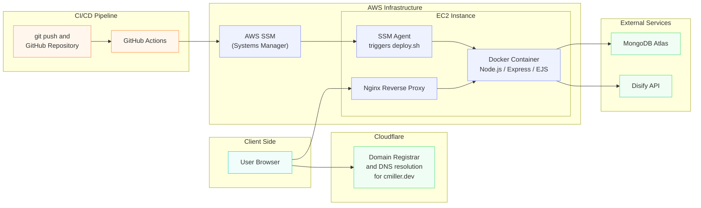
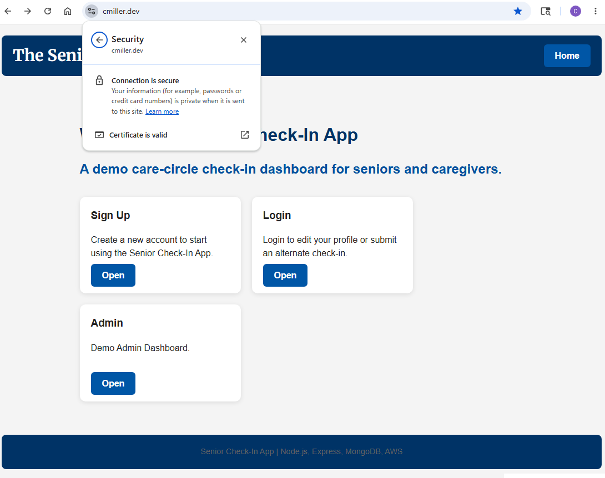
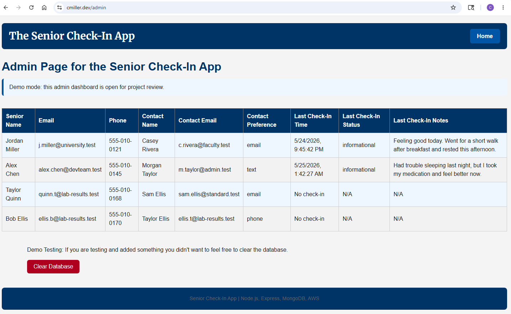
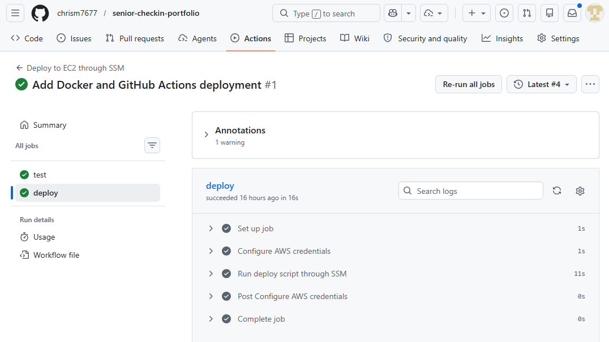

## Senior Check-In App
Full-stack web application for monitoring senior wellness and check-ins. 
Deployed on AWS using Docker, Nginx, MongoDB, and GitHub Actions.

## Live Demo
https://senior.cmiller.dev/

Note: free-tier hosting may sleep

## App Features
- Account registration and profile management
- Backup check-in for mobile app check-ins
- Admin dashboard for monitoring accounts and check-ins
- Email validation API integration

## Technology Features
- MongoDB database integration with Mongoose
- HTTPS reverse proxy using Nginx
- Jest/Supertest integration testing
- Dockerized deployment
- Automated deployment with GitHub Actions

## Tech Stack
### Frontend
- HTML
- CSS
- EJS Templates
### Backend
- Node.js
- Express.js
- HTTPS with Nginx reverse proxy
### Database
- MongoDB
- Mongoose
### DevOps / Deployment
- AWS EC2
- Docker
- GitHub Actions
- PM2 (earlier version)
### Testing
- Jest
- Supertest

## Architecture Overview

## CI/CD Pipeline
GitHub Actions automatically:
1. Runs Jest/Supertest integration tests
2. Blocks deployment if tests fail
3. Authenticates with AWS using GitHub OIDC and IAM roles.
4. Uses AWS Systems Manager (SSM) to trigger deployment.
5. Instructs the local EC2 SSM agent to run `deploy.sh`, which:
    - Pulls latest code
    - Rebuilds/restarts Docker containers

## Future Improvements
- bcrypt passwords
- Implement session authentication
- React frontend migration
- Kubernetes deployment

## Home Screen

## Admin Dashboard

## CI/CD Pipeline

